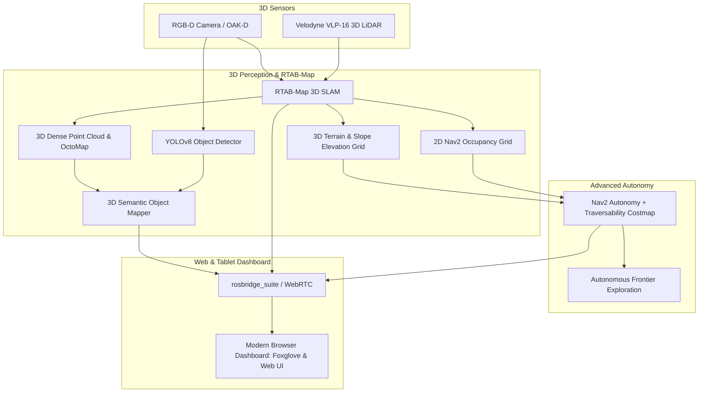

# Advanced Jackal: 3D Autonomy, RTAB-Map SLAM & Modern UI Dashboard

## Executive Overview

This plan outlines the next-generation architecture for the **Clearpath Jackal (J100)** on the `advance-jackal` branch. It expands the baseline 2D pipeline into a full **3D Spatial Autonomy & Modern Web Dashboard Platform**:



---

## 1. Can We Use RTAB-Map? (Yes — Technical Deep Dive)

**RTAB-Map (Real-Time Appearance-Based Mapping)** is the industry standard for 3D multi-modal SLAM in ROS 2. 

### Why RTAB-Map is ideal for our Jackal:
1. **Multi-Sensor Fusion (3D LiDAR + RGB-D Camera)**:
   - Combines 3D point clouds from the **Velodyne VLP-16** with RGB-D visual frames.
   - Uses LiDAR for high-accuracy geometric odometry and the camera for visual loop closure (Bag-of-Words).
2. **3D Elevation, Slopes & OctoMap**:
   - Generates true **3D voxel maps (OctoMap)** and **elevation point clouds**.
   - Captures terrain slopes, ramps, steps, and overhanging obstacles that 2D LiDAR completely misses.
3. **Nav2 Compatibility**:
   - Automatically outputs a projected 2D costmap (`/map`) and a 3D obstacle point cloud so Nav2's global/local planners work without modifications.
4. **Memory Management for Large Environments**:
   - Features Long-Term & Short-Term Memory (LTM / STM) nodes to prevent memory explosion during large warehouse or outdoor runs.

---

## 2. Pillar 1: Advanced 3D Autonomy Architecture

### A. 3D Terrain Elevation & Slope Traversability
- **Slope Angle & Inclinometer Calculation**: Extract Jackal's IMU pitch and roll ($\theta_p, \theta_r$) to compute real-time terrain inclination.
- **Traversability Costmap Layer**:
  - Slopes $< 15^\circ$: Normal navigable cost.
  - Slopes $15^\circ - 25^\circ$: High cost (robot slows down to prevent tipping).
  - Slopes $> 25^\circ$ or drop-offs: Lethal obstacle cost (robot forbids entry).

### B. Autonomous Frontier Exploration (`explore_lite`)
- Eliminates manual joystick teleoperation during mapping.
- The exploration node detects boundaries between known free space and unknown space, assigns exploration goals to the largest information-gain frontiers, and maps entire facilities fully autonomously.

### C. 3D Semantic Object Mapping
- Bridges YOLOv8 with 3D point clouds.
- Projects 2D detection bounding boxes into 3D world coordinates $(X, Y, Z)$ using camera intrinsics and TF transforms.
- Publishes persistent 3D bounding boxes and text markers in RViz and the Web Dashboard.

---

## 3. Pillar 2: Modern Web & Tablet User Interface

A high-performance, browser-based user interface accessible from any laptop, iPad, or smartphone on the robot's Wi-Fi network:

```text
┌─────────────────────────────────────────────────────────────────────────────────┐
│  SAFiR LAB — JACKAL FLEET COMMAND DASHBOARD [v2.0-advanced]                     │
├────────────────────────────────┬────────────────────────────────────────────────┤
│  🎥 LIVE HD CAMERA FEED        │  🗺️ 3D INTERACTIVE TERRAIN MAP                │
│  [ YOLOv8 Realtime Overlays ]  │  [ RTAB-Map 3D Pointcloud + Jackal 3D Model ]  │
│  • Person (92%)                │  • Trajectory History & Elevation Grid         │
│  • Forklift (88%)              │  • Click-to-Navigate 3D Goal Tool              │
├────────────────────────────────┴────────────────────────────────────────────────┤
│  📊 ROBOT TELEMETRY & INCLINOMETER            🕹️ MISSION DISPATCH & CONTROL     │
│  • Battery: 25.4V (88%)  • CPU: 32% (48°C)    [ ▶ Auto Explore ]  [ ⏹ Cancel ]   │
│  • Pitch: +4.2° (Safe)   • Roll: -1.1° (Safe) [ 📍 Patrol Aisle ] [ 🚨 E-STOP ]  │
└─────────────────────────────────────────────────────────────────────────────────┘
```

### Dashboard Core Capabilities:
1. **Low-Latency Video Stream**: WebRTC / MJPEG stream of raw RGB and YOLO detection feeds (<80ms latency).
2. **Interactive 3D Web Visualizer**: Three.js / Foxglove Studio rendering 3D point clouds, robot pose, costmaps, and waypoints directly in Chrome/Safari.
3. **Live Health & Terrain Inclinometer**: Real-time roll/pitch visual horizon indicator warning of steep slopes, battery status, and motor temperatures.
4. **Mission Dispatcher**: Point-and-click goal dispatching, autonomous exploration trigger, and emergency stop button.

---

## 4. Step-by-Step Implementation Roadmap

| Phase | Milestone | Deliverables |
|---|---|---|
| **Phase 1** | **RTAB-Map 3D SLAM & Elevation Setup** | • Install `rtabmap_ros`<br>• Create `rtabmap.launch.py` with 3D LiDAR & RGB-D fusion<br>• Generate 3D OctoMap and terrain slope elevation grid |
| **Phase 2** | **Slope Traversability & Nav2 3D Obstacle Layer** | • Integrate slope inclination cost layer into `nav2.yaml`<br>• Test Jackal climbing ramps and refusing steep drop-offs |
| **Phase 3** | **Autonomous Frontier Exploration** | • Integrate `explore_lite` for zero-teleop automated mapping<br>• Benchmark exploration completion time |
| **Phase 4** | **3D Semantic Object Projection** | • Build `yolo_to_3d_node.py` to project 2D YOLO boxes to 3D TF markers<br>• Display persistent 3D semantic objects in map |
| **Phase 5** | **Modern Web UI Dashboard** | • Deploy `rosbridge_server` and web dashboard<br>• Add live video, inclinometer gauge, telemetry, and 3D map viewer |
| **Phase 6** | **Benchmarking & Hardware Deployment** | • End-to-end mission demonstration in simulation and real Jackal hardware |

---

## 5. Branch Workflow

- **Active Branch**: `advance-jackal`
- **Stable Base**: `project_zero` (tagged `v1.3.0-stable`)
- All new features will be developed incrementally with isolated launch files so the baseline pipeline remains 100% stable.
