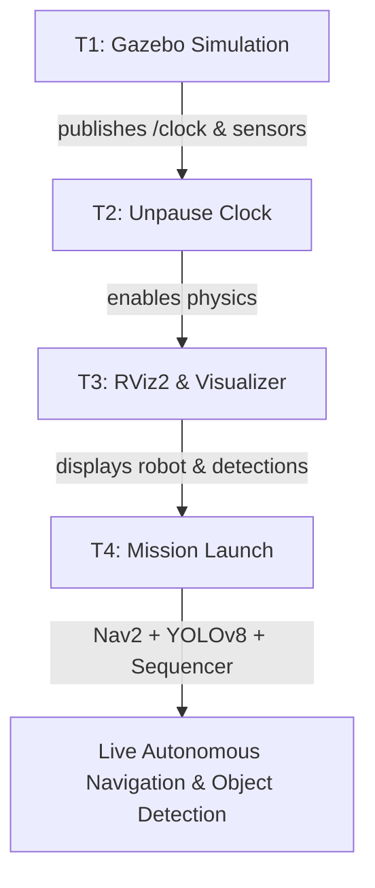

# Project Zero — Comprehensive Testing & Execution Guide

Step-by-step commands to run, test, and **capture evidence** for the Clearpath Jackal autonomy and vision pipeline in Gazebo Harmonic and real hardware.

---

## 0. Build & Environment Preparation

Before launching any nodes, build the workspace and install required dependencies:

```bash
cd ~/Project-Zero
source /opt/ros/humble/setup.bash
pip install ultralytics opencv-python-headless
rosdep install -r --from-paths src -i -y
colcon build --symlink-install
source install/setup.bash
```

---

## 1. Complete Visual Mission Execution (All-in-One)

Follow these 4 terminals to run the entire pipeline while **visually watching the robot move and detect objects in real-time**:



### Terminal 1 — Start Gazebo Simulation
```bash
cd ~/ali/Project-Zero
source /opt/ros/humble/setup.bash
source install/setup.bash
ros2 launch clearpath_gz simulation.launch.py
```

### Terminal 2 — Unpause Simulation Clock
```bash
ign service -s /world/warehouse/control --reqtype ignition.msgs.WorldControl --reptype ignition.msgs.Boolean --timeout 3000 --req 'pause: false'
```

### Terminal 3 — Launch Pre-Configured RViz2 Visualizer
> **What you will see in RViz2:**
> * **Robot Model & Map**: 3D Jackal navigating over the 2D warehouse map.
> * **Nav2 Costmaps & Paths**: Red global path and blue local trajectory planner.
> * **Localization (AMCL)**: Green particle cloud tracking robot pose in real time.
> * **LiDAR Scan**: 2D laser scan points aligned with warehouse walls and obstacles.
> * **YOLO Vision Inset**: Live camera feed with color-coded bounding boxes and detection labels.

*Option A (Recommended — One simple launch command):*
```bash
cd ~/ali/Project-Zero
source /opt/ros/humble/setup.bash
source install/setup.bash
ros2 launch jackal_vision rviz.launch.py
```

*Option B (Direct CLI command):*
```bash
cd ~/ali/Project-Zero
source /opt/ros/humble/setup.bash
source install/setup.bash
ros2 run rviz2 rviz2 \
    -d ~/ali/Project-Zero/src/jackal_vision/config/mission_viz.rviz \
    --ros-args -r __ns:=/j100_0000 -p use_sim_time:=true
```

### Terminal 4 — Launch Autonomous Mission & YOLO Detection
```bash
cd ~/ali/Project-Zero
source /opt/ros/humble/setup.bash
source install/setup.bash
ros2 launch jackal_mission mission.launch.py \
    use_sim_time:=true \
    map:=~/ali/Project-Zero/maps/warehouse_map.yaml
```

*(Optional) Terminal 5 — Standalone High-Resolution YOLO Camera Viewer:*
```bash
source /opt/ros/humble/setup.bash
ros2 run rqt_image_view rqt_image_view /j100_0000/yolo_detector/detections_image
```

---

### Option B: Modular / Step-by-Step Individual Component Execution

If you want to run and debug each component individually in separate terminals:

| Terminal | Component | Exact Command |
|---|---|---|
| **T1: Gazebo Simulation** | Simulation World & Jackal | `ros2 launch clearpath_gz simulation.launch.py` |
| **T2: Unpause Clock** | Simulation Physics & Clock | `ign service -s /world/warehouse/control --reqtype ignition.msgs.WorldControl --reptype ignition.msgs.Boolean --timeout 3000 --req 'pause: false'` |
| **T3: Sensor Bridge** | 3D PointCloud $\to$ 2D LaserScan | `ros2 launch launch/pointcloud_to_laserscan.launch.py` |
| **T4: AMCL Localization** | Map Server & AMCL | `ros2 launch clearpath_nav2_demos localization.launch.py use_sim_time:=true setup_path:=$HOME/clearpath/ map:=$(pwd)/maps/warehouse_map.yaml` |
| **T5: Nav2 Autonomy** | Planners, Controllers, Recoveries | `ros2 launch clearpath_nav2_demos nav2.launch.py use_sim_time:=true setup_path:=$HOME/clearpath/` |
| **T6: YOLOv8 Detector** | Vision Object Detection | `ros2 launch jackal_vision vision.launch.py namespace:=j100_0000 use_sim_time:=true` |
| **T7: RViz2 Visualizer** | Full Displays & Camera Overlay | `ros2 run rviz2 rviz2 -d src/jackal_vision/config/mission_viz.rviz --ros-args -r __ns:=/j100_0000 -p use_sim_time:=true` |
| **T8: Mission Node** | Waypoint Sequencer & Reports | `ros2 run jackal_mission mission_node --ros-args -r __ns:=/j100_0000 -p use_sim_time:=true` |

*(Optional standalone camera viewer)*:
```bash
ros2 run rqt_image_view rqt_image_view /j100_0000/yolo_detector/detections_image
```

---

## 2. Test SLAM (Mapping) — Capture Evidence

### Step 1: Start Simulation & Bridge
```bash
# Terminal 1 — Gazebo
ros2 launch clearpath_gz simulation.launch.py

# Terminal 2 — Unpause Clock
ign service -s /world/warehouse/control --reqtype ignition.msgs.WorldControl --reptype ignition.msgs.Boolean --timeout 3000 --req 'pause: false'

# Terminal 3 — 3D to 2D LiDAR Bridge
ros2 launch launch/pointcloud_to_laserscan.launch.py
```

### Step 2: Start SLAM Toolbox
```bash
# Terminal 4
export RMW_IMPLEMENTATION=rmw_cyclonedds_cpp
source install/setup.bash
ros2 launch clearpath_nav2_demos slam.launch.py \
    use_sim_time:=true \
    setup_path:=$HOME/clearpath/
```

### Step 3: Launch RViz Visualizer
```bash
# Terminal 5
ros2 launch clearpath_viz view_navigation.launch.py namespace:=j100_0000 use_sim_time:=true
```

### Step 4: Teleoperate Robot
```bash
# Terminal 6
ros2 run teleop_twist_keyboard teleop_twist_keyboard \
    --ros-args -r /cmd_vel:=/j100_0000/cmd_vel
```

### Step 5: Save Map
```bash
ros2 run nav2_map_server map_saver_cli -f maps/warehouse_map --ros-args -p use_sim_time:=true
```

---

## 3. Test Localization (AMCL) — Capture Evidence

```bash
# Terminal: Start Localization
ros2 launch clearpath_nav2_demos localization.launch.py \
    use_sim_time:=true \
    setup_path:=$HOME/clearpath/ \
    map:=$(pwd)/maps/warehouse_map.yaml
```

### 📸 Evidence Commands
```bash
# Check AMCL Pose
ros2 topic echo /j100_0000/amcl_pose --once | tee amcl_pose.txt

# Verify TF Transform (map -> odom -> base_link)
ros2 run tf2_ros tf2_echo map odom --ros-args -r /tf:=/j100_0000/tf -r /tf_static:=/j100_0000/tf_static
```

---

## 4. Test Navigation (Nav2) — Capture Evidence

```bash
# Terminal: Start Nav2
ros2 launch clearpath_nav2_demos nav2.launch.py \
    use_sim_time:=true \
    setup_path:=$HOME/clearpath/
```

### 📸 Evidence Commands
- Send goal in RViz2 using **Nav2 Goal** tool.
- Test obstacle avoidance by spawning an obstacle in Gazebo in front of the robot.
- Check Nav2 feedback:
```bash
ros2 topic echo /j100_0000/navigate_to_pose/_action/feedback --once | tee nav2_feedback.txt
```

---

## 5. Test Vision (YOLOv8) — Capture Evidence

```bash
# Terminal: Start YOLOv8 Detector
ros2 launch jackal_vision vision.launch.py namespace:=j100_0000 use_sim_time:=true
```

### 📸 Evidence Commands
```bash
# Check Detections topic (vision_msgs/Detection2DArray)
ros2 topic echo /j100_0000/yolo_detector/detections --once | tee yolo_detections.txt

# Standalone annotated image viewer
ros2 run rqt_image_view rqt_image_view /j100_0000/yolo_detector/detections_image
```

---

## 6. Full Mission Demonstration & Report Verification

```bash
# Start Full Mission
ros2 launch jackal_mission mission.launch.py \
    use_sim_time:=true \
    map:=$(pwd)/maps/warehouse_map.yaml
```

### 📸 Mission Reports
Reports are automatically timestamped and saved in `/tmp/jackal_mission_reports/`:
```bash
ls -la /tmp/jackal_mission_reports/
cat /tmp/jackal_mission_reports/mission_*.txt
```

---

## Evidence Checklist for Deliverables

| Requirement | Description | Evidence Output |
|---|---|---|
| **Req 1** | Clean ROS2 Workspace | Build succeeds cleanly via `colcon build` |
| **Req 2** | Sensor Integration & TF | `frames_*.pdf`, `slam_topics.txt` |
| **Req 3** | Mapping (SLAM Toolbox) | `maps/warehouse_map.yaml`, `maps/warehouse_map.pgm` |
| **Req 4** | Localization (AMCL) | Particle cloud screenshot, `amcl_pose.txt` |
| **Req 5** | Navigation (Nav2) | Goal trajectory screenshot, `nav2_feedback.txt` |
| **Req 6** | Vision (YOLOv8) | `yolo_detections.txt`, detection images |
| **Req 7** | System Integration | `/tmp/jackal_mission_reports/mission_*.json`, `.txt` |
